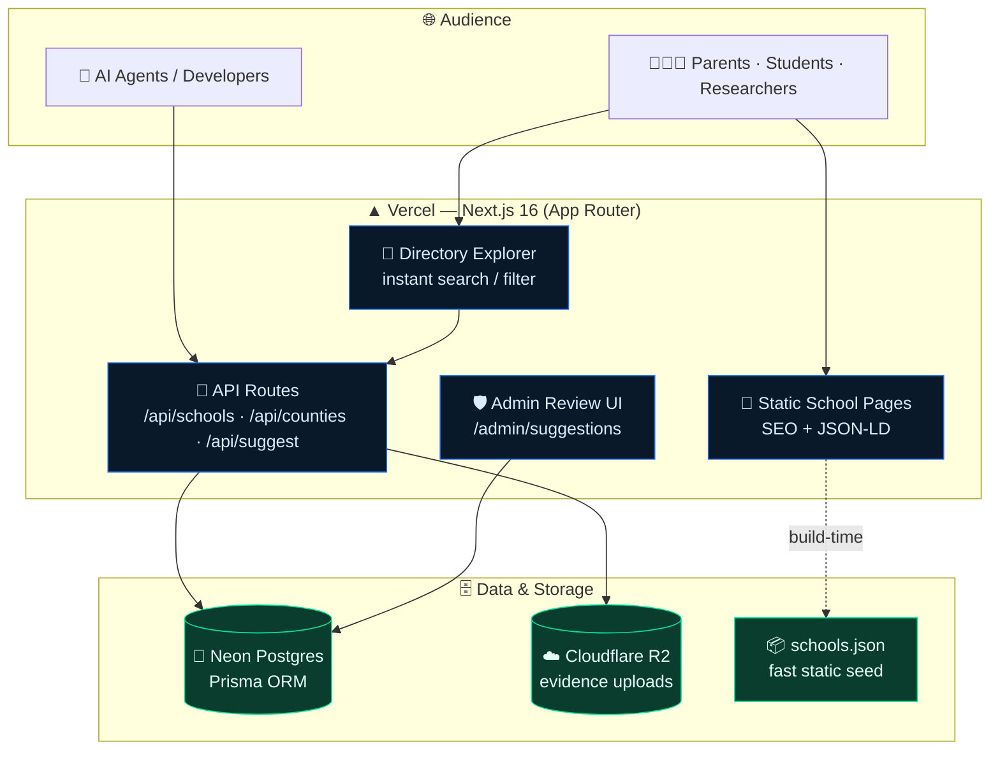
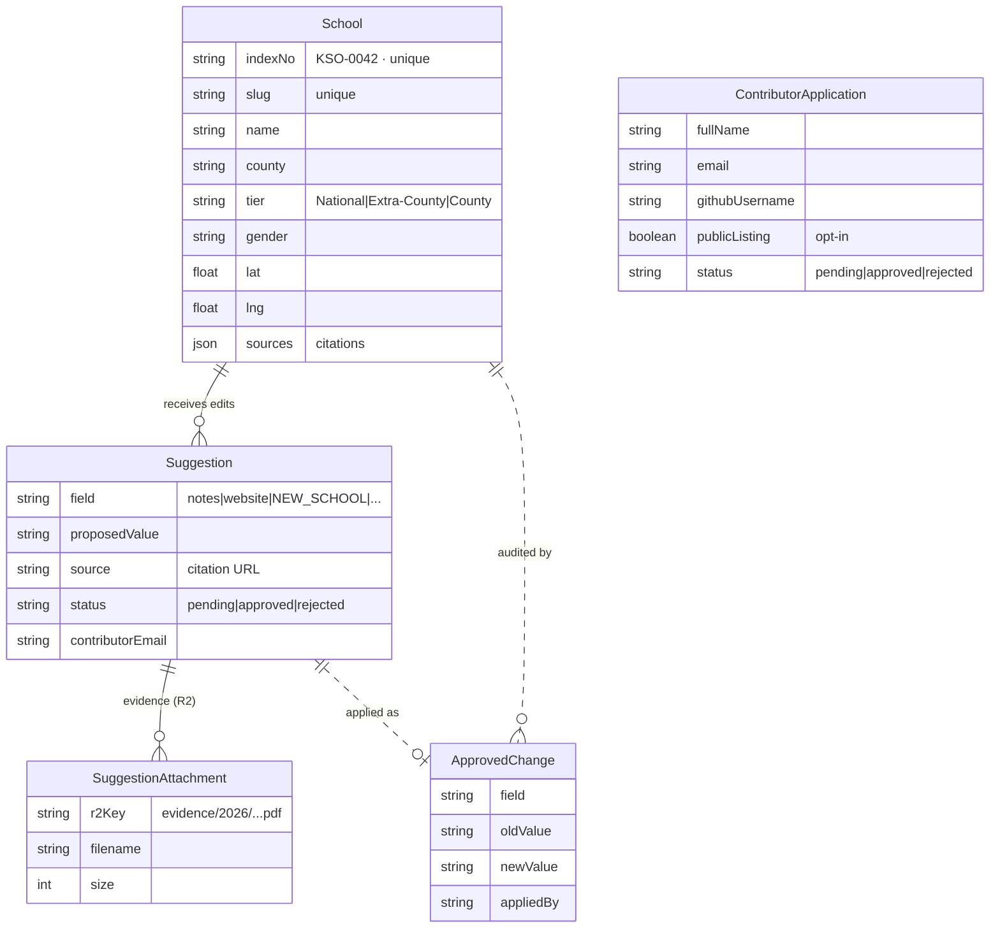
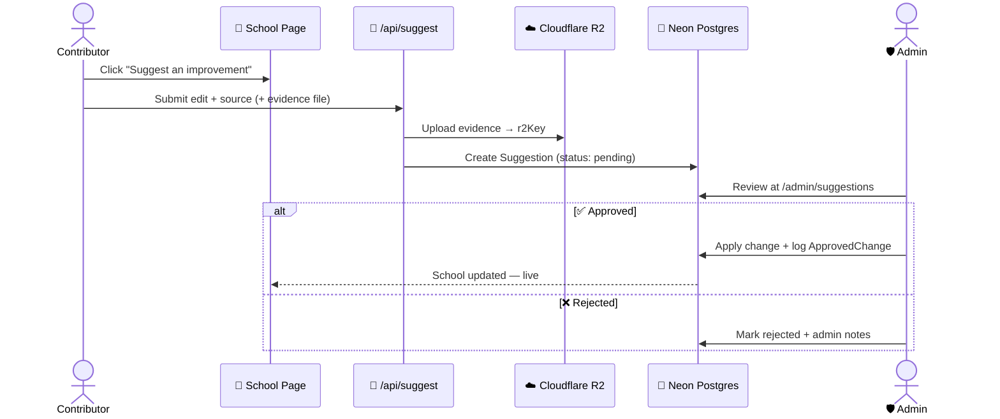
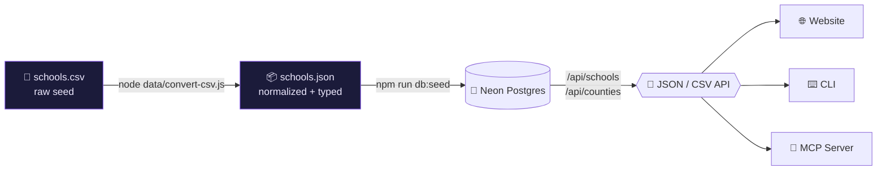
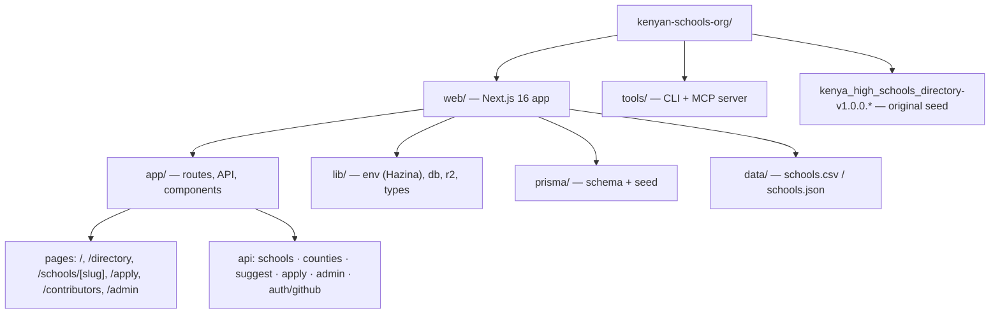

```text
██╗  ██╗███████╗███╗   ██╗██╗   ██╗ █████╗ ███╗   ██╗    ███████╗ ██████╗██╗  ██╗ ██████╗  ██████╗ ██╗     ███████╗
██║ ██╔╝██╔════╝████╗  ██║╚██╗ ██╔╝██╔══██╗████╗  ██║    ██╔════╝██╔════╝██║  ██║██╔═══██╗██╔═══██╗██║     ██╔════╝
█████╔╝ █████╗  ██╔██╗ ██║ ╚████╔╝ ███████║██╔██╗ ██║    ███████╗██║     ███████║██║   ██║██║   ██║██║     ███████╗
██╔═██╗ ██╔══╝  ██║╚██╗██║  ╚██╔╝  ██╔══██║██║╚██╗██║    ╚════██║██║     ██╔══██║██║   ██║██║   ██║██║     ╚════██║
██║  ██╗███████╗██║ ╚████║   ██║   ██║  ██║██║ ╚████║    ███████║╚██████╗██║  ██║╚██████╔╝╚██████╔╝███████╗███████║
╚═╝  ╚═╝╚══════╝╚═╝  ╚═══╝   ╚═╝   ╚═╝  ╚═╝╚═╝  ╚═══╝    ╚══════╝ ╚═════╝╚═╝  ╚═╝ ╚═════╝  ╚═════╝ ╚══════╝╚══════╝

██████╗ ██╗██████╗ ███████╗ ██████╗████████╗ ██████╗ ██████╗ ██╗   ██╗
██╔══██╗██║██╔══██╗██╔════╝██╔════╝╚══██╔══╝██╔═══██╗██╔══██╗╚██╗ ██╔╝
██║  ██║██║██████╔╝█████╗  ██║        ██║   ██║   ██║██████╔╝ ╚████╔╝
██║  ██║██║██╔══██╗██╔══╝  ██║        ██║   ██║   ██║██╔══██╗  ╚██╔╝
██████╔╝██║██║  ██║███████╗╚██████╗   ██║   ╚██████╔╝██║  ██║   ██║
╚═════╝ ╚═╝╚═╝  ╚═╝╚══════╝ ╚═════╝   ╚═╝    ╚═════╝ ╚═╝  ╚═╝   ╚═╝
```

<div align="center">

**A transparent, accessible, and reliable public data resource for every Kenyan secondary school.**

[](https://kenyanschools.org)
[](https://kenyanschools.org/schools)
[](https://kenyanschools.org/directory)


-yellow)

Built and maintained by **[CodeAmani Labs](https://codeamanilabs.org/)** &nbsp;·&nbsp; Founder: [codeAmani-Solutions (Barnabas Waweru)](https://github.com/codeAmani-Solutions)

</div>

---

## 📖 Table of Contents

- [Overview](#-overview)
- [Features](#-features)
- [System Architecture](#-system-architecture)
- [Data Model](#-data-model)
- [Contribution Flow](#-contribution-flow)
- [Data Pipeline](#-data-pipeline)
- [Getting Started](#-getting-started-local)
- [Public API, CLI & MCP](#-public-api-cli--mcp)
- [SEO Strategy](#-seo-strategy)
- [Deployment (Vercel + Porkbun)](#-deployment-vercel--porkbun)
- [Environment & Secrets (Hazina)](#-environment--secrets-hazina)
- [Repository Structure](#-repository-structure)
- [Versioning](#-versioning)
- [Contributing](#-contributing)
- [License](#-license)

---

## 🌍 Overview

The **Kenyan Schools Directory** is a canonical, living reference for Kenya's education data — open to parents, students, researchers, policymakers, developers, and AI agents.

- **1,127+ schools** across all **47 counties** of Kenya
- **National**, **Extra-County**, and **County** tiers
- Verified **sources, citations, geolocations**, and community contributions
- Open **API, CLI, and MCP** tools for data extraction
- Modern, fast, SEO-first platform for public education data

> **Mission (CodeAmani Labs).** Build open public goods rooted in **transparency** (every entry is sourced and auditable), **access** (free, open data for everyone), **modern tracking** (dynamic updates, version history, geographic + structured data), and **reliable public data** (community-powered with strict verification).

**Official site:** https://kenyanschools.org

---

## ✨ Features

| | |
|---|---|
| 🔎 **Instant search + filters** | County, tier, and gender filtering with snappy client-side UX |
| 🏫 **Rich school profiles** | Names, address, geo, contacts, sports nicknames, and cited sources |
| ✏️ **One-click "Suggest edit"** | Every profile accepts community improvements with evidence |
| ➕ **Structured "Add new school"** | Guided proposal flow for missing schools |
| 📤 **Export results** | Download filtered data as JSON or CSV |
| 🤖 **Agent-ready** | Public REST API, CLI, and an MCP server |
| ⚡ **SEO-first** | Static school pages, JSON-LD, sitemap, canonical URLs |

---

## 🧱 System Architecture



**Hybrid rendering** — the directory reads fast static JSON for instant filtering, while every contribution writes **live** to Neon (+ R2 for evidence) and surfaces in the Admin review UI.

---

## 🧬 Data Model

The schema (`web/prisma/schema.prisma`) is backed by **Neon Postgres** via the **Prisma Neon adapter**. Solid lines are real Prisma relations; dashed lines are logical (audit) links.



> `ContributorApplication` powers the [/apply](https://kenyanschools.org/apply) flow and the opt-in public [/contributors](https://kenyanschools.org/contributors) list. It is an independent entity (people behind contributions), not a foreign key on edits.

---

## 🔄 Contribution Flow

Every edit is **sourced**, **moderated**, and **audited** before it goes live.



---

## 🔧 Data Pipeline

Raw seed data is normalized, typed, and seeded into Neon — then served to every consumer through one API.



Regenerate the JSON after editing the CSV:

```bash
cd web
node data/convert-csv.js
```

---

## 🚀 Getting Started (Local)

```bash
cd web
npm install
npm run dev
```

Visit **http://localhost:3000**.

Seed data lives in `web/data/schools.json` (normalized) and `web/data/schools.csv` (raw), and is seeded to **Neon Postgres** for production.

Useful scripts (`web/package.json`):

| Command | Purpose |
|---|---|
| `npm run dev` | Start the Next.js dev server |
| `npm run build` | `prisma generate` + production build |
| `npm run db:push` | Push the Prisma schema to Neon |
| `npm run db:seed` | Seed the database (`prisma/seed.ts`) |
| `npm run db:studio` | Open Prisma Studio |

---

## 🔌 Public API, CLI & MCP

The directory is **agent- and developer-friendly**. All tools read the live (Neon) data through the public API.

### REST API

| Endpoint | Description |
|---|---|
| `GET /api/schools` | Search & filter — `q`, `county`, `tier`, `gender`, `limit`, `offset`, `sort`, `format=json\|csv` |
| `GET /api/counties` | All counties with school counts |
| `GET /api/schools/[slug]` | A single school by slug |
| `GET /schools` | Full alphabetical index page (great for crawling + name discovery) |

```bash
# Example: 10 National schools in Nairobi
curl "https://kenyanschools.org/api/schools?county=Nairobi&tier=National&limit=10"
```

### CLI

```bash
cd tools
npm install
node cli.js search "commandos" --county Kakamega --limit 5
node cli.js counties
node cli.js school mama-ngina-girls-high-school
node cli.js stats
```

### MCP Server

```bash
cd tools
npm run mcp          # or: node mcp-server.js  (stdio protocol)
```

Exposed tools: `search_schools`, `get_school`, `list_counties`, `get_directory_stats`.

The MCP server targets the live API (override with the `KENYAN_SCHOOLS_API` env var). Full details in **[`tools/README.md`](tools/README.md)**.

---

## 🔍 SEO Strategy

School names rank well — even partial names, counties, and "schools in Kenya" queries — because each page is optimized end to end:

- Exact school names in **URL slugs**, `<title>` tags, **H1** headings, and meta descriptions
- **JSON-LD** structured data (`@type: School` with `name`, `alternateName`, `address`, `geo`, `areaServed: Kenya`, publisher: CodeAmani Labs)
- `/sitemap.xml` includes **every school** + county-focused links
- Fast **static generation** for school pages (excellent for indexing)
- Proper `robots.txt` and **canonical URLs**

This drives strong visibility for exact names, partial names (e.g. "Ngina Girls", "Kakamega High"), "Schools in [County] Kenya", and "Kenyan secondary schools".

---

## 🚢 Deployment (Vercel + Porkbun)

1. Push this repo to GitHub.
2. Import into **Vercel**; set the project **Root Directory** to `web`.
3. Add environment variables in Vercel (encrypted) — see [Environment & Secrets](#-environment--secrets-hazina).
4. Deploy.
5. In **Porkbun** (domain `kenyanschools.org`): add a `CNAME` for `@`/`www` → `cname.vercel-dns.com`, or use Vercel's nameservers.
6. Add the custom domain in Vercel project settings.

Full instructions: **[`web/DEPLOY.md`](web/DEPLOY.md)**.

---

## 🔐 Environment & Secrets (Hazina)

Environment variables are centralized and typed through a **Hazina-style loader** (`web/lib/env.ts`):

- Centralized, **typed access** to all env vars
- **Fails fast** on missing critical secrets (with safe build-time placeholders for CI)
- Clear split between public (`NEXT_PUBLIC_*`) and server-only secrets
- Ready for encrypted storage with env fallback

```ts
import { env } from '@/lib/env';
const dbUrl = env.DATABASE_URL;
```

Key variables: `DATABASE_URL` (Neon), `ADMIN_SECRET`, `CLOUDFLARE_R2_*` (evidence storage), `GITHUB_CLIENT_*` (OAuth for `/apply`), `RESEND_API_KEY`, `AI_GATEWAY_API_KEY`, `PORKBUN_*`.

> **Secrets policy:** all secrets live in gitignored `.env*` files. Use `.env.example` as the template. Set encrypted values in Vercel for preview/production. **Never commit real credentials.**

---

## 📁 Repository Structure



```text
kenyan-schools-org/
├── web/                      # Next.js 16 app (deploy root)
│   ├── app/                  # App Router: pages, API routes, components
│   ├── lib/                  # env.ts (Hazina), db.ts (Prisma+Neon), r2.ts, types.ts
│   ├── prisma/               # schema.prisma + seed.ts
│   └── data/                 # schools.csv (raw) + schools.json (typed)
├── tools/                    # CLI (cli.js) + MCP server (mcp-server.js)
├── kenya_high_schools_directory-v1.0.0.{csv,md,xlsx}   # original seed
└── README.md
```

---

## 📦 Versioning

Current version: **1.0.0** — tracked in `web/package.json`, shown in the site footer and About page, with changes documented via Git history.

---

## 🤝 Contributing

1. Fork the repo (maintained by **CodeAmani Labs**).
2. Browse https://kenyanschools.org → open any school page → **"Suggest an improvement"**, use the [Contribute form](https://kenyanschools.org/contribute), or open a PR editing `web/data/schools.json`.
3. **All contributions must include a verifiable source** (URL preferred) — this keeps the resource trustworthy.

Want a deeper role? Apply at https://kenyanschools.org/apply (tracked via GitHub/email; opt into the public [contributors list](https://kenyanschools.org/contributors)).

### Repositories

| Role | URL |
|---|---|
| **Primary** (org) | https://github.com/codeAmani-Labs/kenyan-schools-org |
| **Mirror** (founder) | https://github.com/codeAmani-Solutions/kenyan-schools-org |

```bash
# Set up both remotes locally
git remote set-url origin https://github.com/codeAmani-Labs/kenyan-schools-org.git
git remote add personal https://github.com/codeAmani-Solutions/kenyan-schools-org.git
git push origin master
git push personal master
```

---

## 📜 License

See **[LICENSE](LICENSE)** — the **CodeAmani License** (MIT-based) with attribution to CodeAmani Labs. Data is intended as an open public resource with proper source attribution; see individual source citations for terms.

---

<div align="center">

**Built and maintained by [CodeAmani Labs](https://codeamanilabs.org/)**

[Website](https://kenyanschools.org) · [GitHub Org](https://github.com/codeAmani-Labs) · Founder: [codeAmani-Solutions (Barnabas Waweru)](https://github.com/codeAmani-Solutions)

*Transparent sources · Open access · Reliable public data — built from the original `kenya_high_schools_directory-v1.0.0.*` seed.*

Questions or ideas? [Open an issue](https://github.com/codeAmani-Labs/kenyan-schools-org/issues).

</div>
